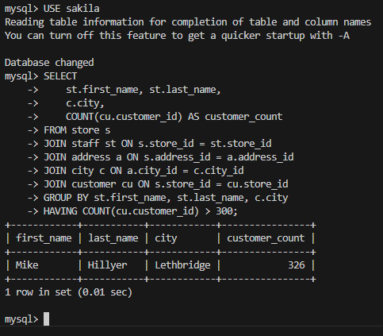
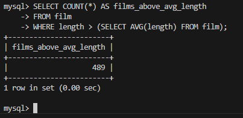
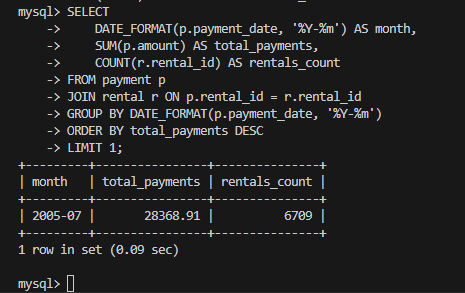

# sdb-homeworks-12-04

# Занятие «SQL. Часть 2»

```
USE sakila
```

### Задание 1
Одним запросом получите информацию о магазине, в котором обслуживается более 300 покупателей, и выведите в результат следующую информацию: 
- фамилия и имя сотрудника из этого магазина;
- город нахождения магазина;
- количество пользователей, закреплённых в этом магазине.

### Ответ задание 1

```
SELECT 
    st.first_name, st.last_name, 
    c.city, 
    COUNT(cu.customer_id) AS customer_count
FROM store s
JOIN staff st ON s.store_id = st.store_id
JOIN address a ON s.address_id = a.address_id
JOIN city c ON a.city_id = c.city_id
JOIN customer cu ON s.store_id = cu.store_id
GROUP BY st.first_name, st.last_name, c.city
HAVING COUNT(cu.customer_id) > 300;
```




### Задание 2

Получите количество фильмов, продолжительность которых больше средней продолжительности всех фильмов.

### Ответ задание 2

```
SELECT COUNT(*) AS films_above_avg_length
FROM film
WHERE length > (SELECT AVG(length) FROM film);
```



### Задание 3

Получите информацию, за какой месяц была получена наибольшая сумма платежей, и добавьте информацию по количеству аренд за этот месяц.

### Ответ задание 3

```
SELECT 
    DATE_FORMAT(p.payment_date, '%Y-%m') AS month,
    SUM(p.amount) AS total_payments,
    COUNT(DISTINCT p.rental_id) AS rentals_count
FROM payment p
GROUP BY DATE_FORMAT(p.payment_date, '%Y-%m')
ORDER BY total_payments DESC
LIMIT 1;
```

